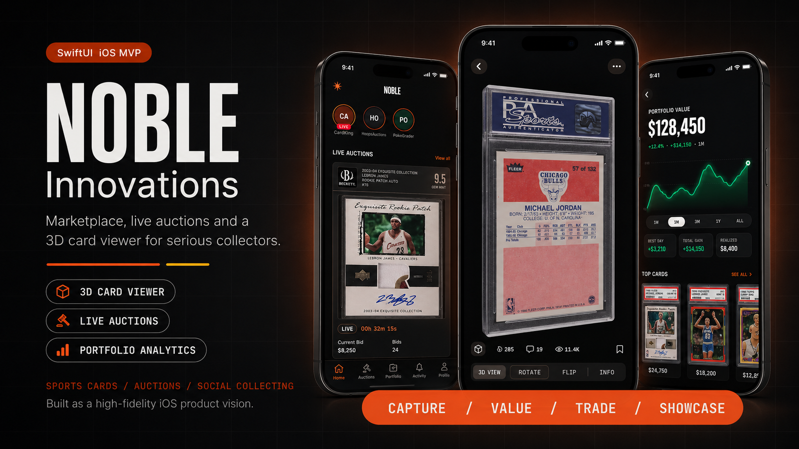
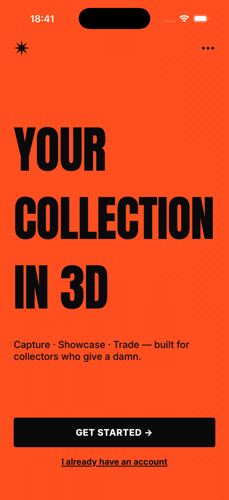
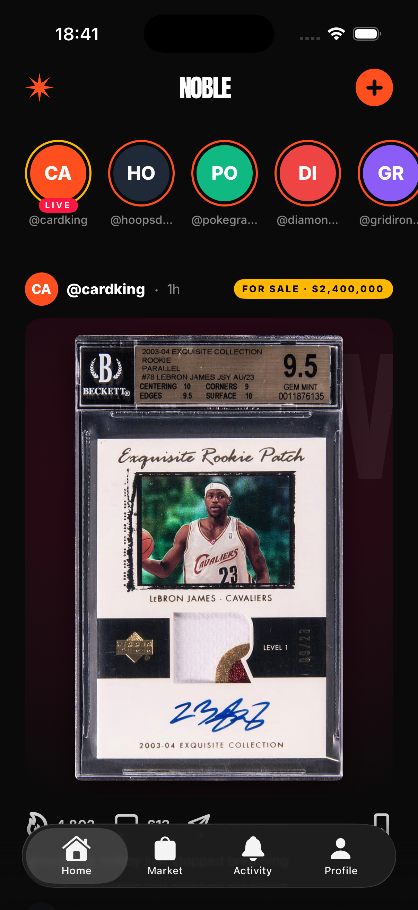
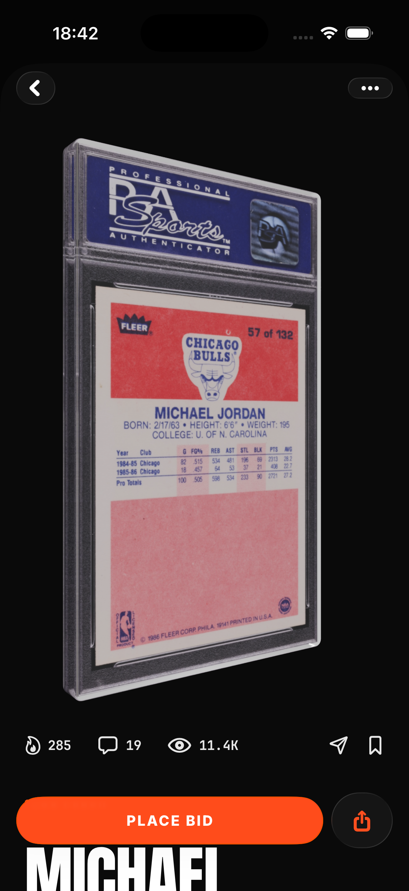
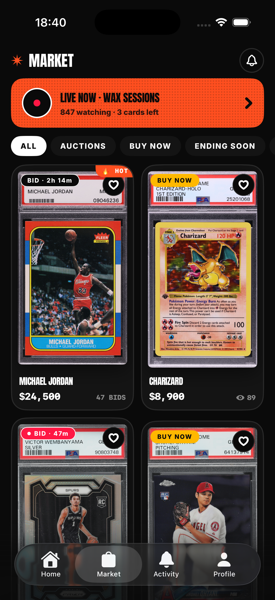
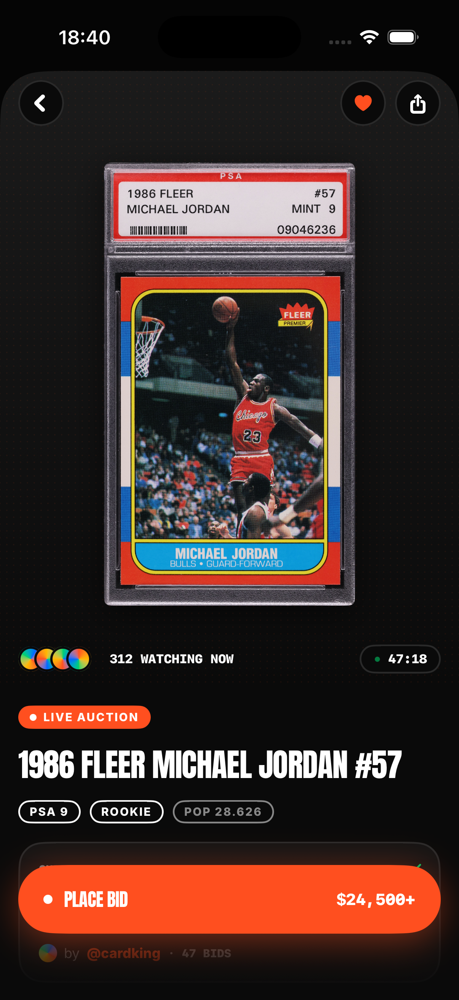
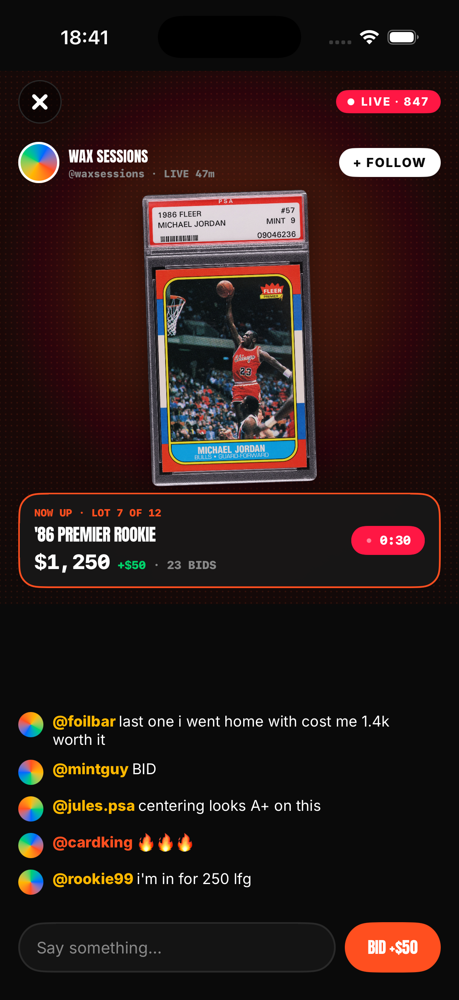
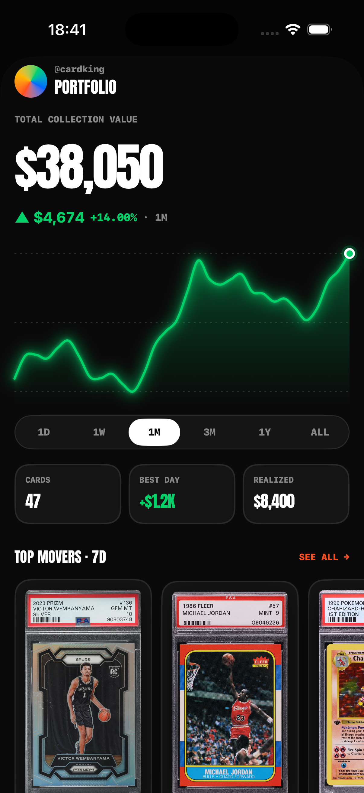
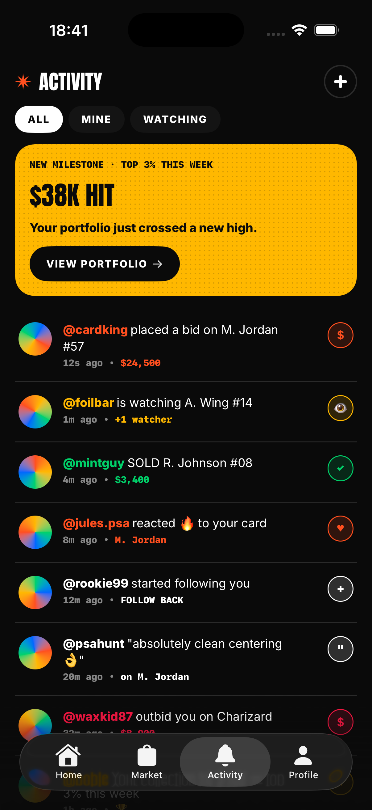
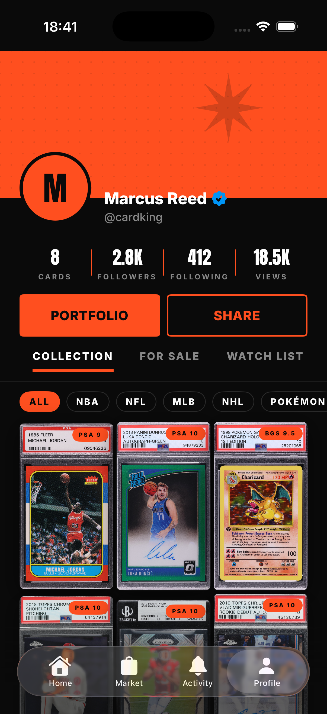

<div align="center">

# **Noble Innovations**



### The collector experience sports cards deserve.

A high-fidelity iOS prototype reimagining how collectors discover, auction, trade, and showcase their cards — built end-to-end as a single, sellable product vision.

<br/>

<a href="docs/video/walkthrough.mp4">
  
</a>

<sub>Tap the preview to play the full <code>walkthrough.mp4</code> — every screen, in 23 seconds.</sub>

<br/>

[](https://swift.org)
[](https://developer.apple.com/ios/)
[](https://developer.apple.com/swiftui/)
[](https://developer.apple.com/documentation/swiftui)

</div>

---

## What's inside

A curated mix of **marketplace · social network · portfolio tracker · live auction house** — under one product, one design language, one continuous flow. Every screen below is built and interactive. Every number, card, bid, and chat message is mock data shaped to feel like a real, living product.

<br/>

<table>
  <tr>
    <td width="33%" align="center">
      <h3>🎴 3D Card Rendering</h3>
      <sub>The flagship. Capture a card with the camera, get back an interactive 3D asset on your profile — pan, pinch, double-tap.</sub>
    </td>
    <td width="33%" align="center">
      <h3>⚡ Live Auctions</h3>
      <sub>Countdown chips, animated bid history, comparable sales strips, sticky <code>PLACE BID</code> CTA with a Liquid Glass drawer.</sub>
    </td>
    <td width="33%" align="center">
      <h3>📡 Whatnot-style Live</h3>
      <sub>Real-time broadcast room with hero card, host info, live chat scroll, urgent countdowns, instant bid buttons.</sub>
    </td>
  </tr>
  <tr>
    <td width="33%" align="center">
      <h3>📈 Portfolio Analytics</h3>
      <sub>$38K hero with smooth Catmull-Rom chart, glow halo, drag-to-scrub with haptics, range selector, top-movers carousel.</sub>
    </td>
    <td width="33%" align="center">
      <h3>🛒 Marketplace Grid</h3>
      <sub>2-col grid with auction/BIN badges, heart-save, hot tags, urgent end-soon countdowns. Tap to enter the full auction view.</sub>
    </td>
    <td width="33%" align="center">
      <h3>🏆 Activity & Milestones</h3>
      <sub>Bid · watch · sale · react · follow · comment · milestone. Yellow milestone hero when the portfolio crosses a new high.</sub>
    </td>
  </tr>
</table>

---

## The full flow

<table>
  <tr>
    <td align="center"><br/><sub><b>Welcome</b></sub></td>
    <td align="center"><br/><sub><b>Feed · LeBron Exquisite RPA</b></sub></td>
    <td align="center"><br/><sub><b>3D Card Viewer</b></sub></td>
  </tr>
  <tr>
    <td align="center"><br/><sub><b>Marketplace</b></sub></td>
    <td align="center"><br/><sub><b>Auction Detail</b></sub></td>
    <td align="center"><br/><sub><b>Live Drop</b></sub></td>
  </tr>
  <tr>
    <td align="center"><br/><sub><b>Portfolio · Interactive Chart</b></sub></td>
    <td align="center"><br/><sub><b>Activity Feed</b></sub></td>
    <td align="center"><br/><sub><b>Profile · Collection</b></sub></td>
  </tr>
</table>

---

## Design system

Everything is built on a single token system — colors, spacing, radius, typography — and a small set of reusable primitives. Every screen reads as the same product.

| Token group | Highlights |
| :--- | :--- |
| **Brand** | `nobleOrange #FF4F1F` · `nobleYellow #FFB800` · `nobleVerified #0095F6` (Instagram blue checkmark) |
| **Surfaces** | `nobleBlack #0A0A0A` · `nobleSurface #141414` · `nobleElevated #1F1F1F` · `nobleBorder #2A2A2A` |
| **Type** | Anton (display, "Druk" substitute) · Inter (UI) · JetBrains Mono (numerals) · Caveat (handwritten accents) |
| **Components** | `SportsCardView` · `Avatar` · `Sparkline` · `CountdownChip` · `NobleButton` · `NoblePill` · `HalftonePattern` · `AsteriskMark` |
| **iOS 26 native** | `TabView` with Liquid Glass, `GlassEffectContainer`, `.glassEffect`, `.buttonStyle(.glassProminent)`, `.scrollEdgeEffectStyle(.soft)` |

---

## Tech stack

<div align="center">

[](https://swift.org)
[](https://developer.apple.com/swiftui/)
[](https://developer.apple.com/ios/)
[](https://developer.apple.com/xcode/)
[](https://developer.apple.com/documentation/combine)
[](https://developer.apple.com/av-foundation/)
[](https://developer.apple.com/sf-symbols/)
[](https://github.com/yonaskolb/XcodeGen)
[-FFB800?style=for-the-badge&logo=javascript&logoColor=black)](https://sparkjs.dev)

</div>

| Layer | Stack |
| :--- | :--- |
| **UI** | SwiftUI (iOS 26), Liquid Glass APIs, custom `SportsCardView` (procedural + asset-based PSA-graded slabs) |
| **3D rendering** | Gaussian Splats (planned via Spark.js / Metal pipeline) — currently mocked with auto-rotating `SplatViewerView` placeholder |
| **Camera** | AVFoundation capture pipeline with 5-second framing window for splat training |
| **State** | SwiftUI `@State`, `@Observable`, value-type mocks (`CardMock`, `AuctionListing`, `ActivityEvent`, `PortfolioHolding`) |
| **Animation** | Native SwiftUI animations, `contentTransition(.numericText)`, `containerRelativeFrame` + `visualEffect` for hero collapse, Catmull-Rom curve interpolation for the portfolio chart |
| **Project gen** | xcodegen (`project.yml`) — single source of truth, no `.xcodeproj` in repo |
| **Fonts** | Anton (display), Inter (UI), JetBrains Mono Bold (numerals), Caveat (script) — all bundled |

---

## Run locally

```bash
# Generate the Xcode project from project.yml
xcodegen generate

# Open and run
open Noble.xcodeproj
```

Optional launch arguments (Edit Scheme → Arguments) jump directly into specific screens — useful for design iteration without onboarding flow:

| Flag | Lands you on |
| :--- | :--- |
| `--start-main` | Main tab bar (Home) |
| `--tab-market` | Marketplace |
| `--tab-activity` | Activity feed |
| `--tab-profile` | Profile |
| `--show-card-detail` | Card detail with 3D viewer |
| `--show-auction` | Auction detail with bid drawer |
| `--show-live` | Live drop broadcast |
| `--show-portfolio` | Portfolio dashboard |
| `--show-camera` | Camera capture |

---

## Status

**MVP visual prototype** — every screen is built, every interaction is wired, every dataset is mock data shaped to feel real. The pieces missing for production are the **3D Gaussian Splat pipeline** (currently a placeholder), **persistence** (SwiftData), and the **server-side marketplace** (auctions, payments, identity).

Built as a vision artifact to communicate what the product *can be* — in motion, on a real device, in 23 seconds.

<br/>

<div align="center">

<sub>Made with care · 2026 · Sports cards collectors actually deserve.</sub>

</div>
